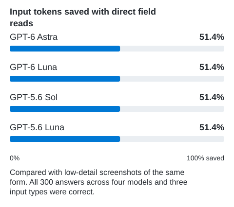
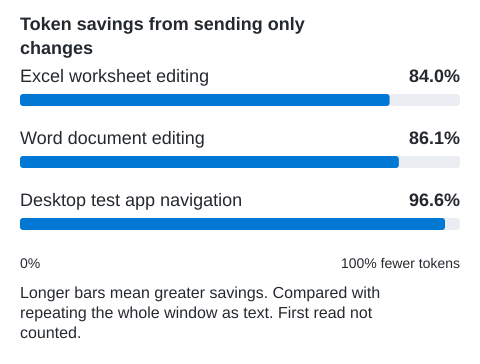

# Windows MCP Server

**Put your AI to work in Windows.**

Fill forms. Read tables. Save files. Give the AI assistant you already use
direct access to your Windows apps.

Windows MCP works with **GitHub Copilot, Claude, Cursor, and other compatible
assistants**, through **MCP or the command line (CLI)**. You do not need to
learn tool names or write automation scripts.

**Direct control. Fewer tokens. Your choice of AI.** Work with real buttons and
fields, read only what the task needs, and request changes instead of repeated
control lists. Screenshots, mouse, and keyboard actions are built in for
visual tasks.

[Get started](#get-started) | [See the real-task benchmark](#real-tasks-controls-first-versus-screenshots)

## Why Windows MCP?

Find the Save button and act on that button. Read a field's value directly.
Check whether a box is ticked without interpreting its appearance. Windows MCP
uses the information apps provide about their controls, rather than relying
only on pictures and screen positions.

| Task | Screenshot-only approach | Windows MCP's first choice |
|------|--------------------------|----------------------------|
| Click Save | Find the button in an image and choose a screen position | Find the named button and act on it |
| Read a field or table | Interpret text and layout in the image | Read the field value or table rows directly |
| Check whether a box is checked | Interpret how the box looks | Read its checked state |
| Check what changed | Capture and interpret another image | Request just the changed controls when possible |
| Choose a model | The screenshot route needs image understanding | Tasks with readable controls can use text replies without images |

Screenshots still matter for drawings, games, and apps with missing accessibility
information. Windows MCP includes screenshots, mouse, keyboard, and text recognition
for those cases. Both approaches are available through the same tools:
**controls first, screenshots when needed**.

[Compare controls and screenshots](https://windowsmcpserver.dev/comparison/).

## MCP or CLI for your agent?

**Both routes give AI agents the same Windows automation capabilities.**

| Route | A good fit when... |
|-------|--------------------|
| **MCP** | Your assistant already connects to MCP tools. |
| **CLI (`wincli`)** | Your coding agent can run commands on your Windows PC through its existing terminal tool. |

You describe the task; the agent chooses the tool calls or commands. With the
CLI, the agent can look up help as needed, without a separate Windows MCP
connection. You do not have to write a script, though scripts can use it too.

The CLI keeps controls and previous views between commands through its own
background service. That state is separate from MCP connections.
[How the two routes work](https://windowsmcpserver.dev/architecture/#mcp-or-cli-for-your-agent).

## Get started

You need an unlocked Windows desktop and either an AI application with MCP
support or an agent that can run commands on that PC.

### VS Code with GitHub Copilot

1. Install [Windows MCP Server](https://marketplace.visualstudio.com/items?itemName=sbroenne.windows-mcp)
   from the VS Code Marketplace.
2. Open Copilot Chat in **Agent** mode, enable the Windows MCP tools, and try a task below.

The extension includes its .NET runtime; no separate .NET installation is needed.

### Claude Desktop, Cursor, and other MCP clients

1. Download the Windows package for your processor from
   [Releases](https://github.com/sbroenne/mcp-windows/releases) and extract it.
   The standalone server includes its runtime.
2. Add the server executable to your client's MCP configuration.
   Use the [setup guide](https://windowsmcpserver.dev/installation/) for the
   configuration file and copyable examples for your client.
3. Restart or reload your client and check that the Windows MCP tools are available.

### Coding agents using the CLI

Let your agent use `wincli` through its existing terminal tool. Follow the
[command-line (CLI) installation and first steps](src/Sbroenne.WindowsMcp.Cli/README.md).
No separate Windows MCP connection is required.

## Try your first task

Open Notepad, then ask your agent:

> Type "Hello from Windows MCP" in Notepad and save it as a new file named
> `windows-mcp-demo.txt` on my Desktop.

Other things to try:

- "Read the error message in this dialog and explain it."
- "Summarize the article in my current Edge window."
- "Read this table and list the entries that are missing a value."
- "Move the Notepad window to my second monitor."

The agent chooses the tools and asks for approval according to your client's
settings. Start with a test document rather than important work.

## Real tasks: controls first versus screenshots

In 16 real-task trials, the controls-first route completed **8 of 8** tasks.
The screenshot-only route completed **7 of 8**. Across the seven matching
app/model pairs where both routes completed, controls first used a median
**34.9% fewer input tokens** and took a median **34.3% less framework session
time**.

The comparison used GPT-6.1 Sol and GPT-6 Luna in Notepad, Word, PowerPoint,
and Chrome. One screenshot-only PowerPoint trial reached the 80-call limit.
Controls were not always cheaper or faster: in the completed GPT-6.1 Sol
PowerPoint pair, controls used 58.1% more input tokens and 35.0% more time.

[See every trial, the limits, and the method](docs/real-app-benchmark.md).

Saved files and submitted values are checked independently, and original
inputs must remain unchanged. The framework records actual model requests,
tools, image detail, usage, and stop reasons. Unsupported evidence stops the
run instead of producing a partial comparison.

[Tasks, safeguards, and reproduction steps](docs/real-app-benchmark.md).

## Save tokens with focused reads

AI services count the text and images they read in units called **tokens**.
Windows MCP can reduce what your assistant has to read in two ways.

### Read one field instead of the whole window

Need a name from a form? Read that field rather than send every button, field,
and menu in the window. In 300 live reads with **GPT-6 Astra, GPT-6 Luna,
GPT-5.6 Sol, and GPT-5.6 Luna**, **every answer was correct**.
Direct reads used **51.4% fewer input tokens than low-detail screenshots**
and **70.5% fewer than high-detail screenshots**. These are reported model
usage counts, including the question and instructions. All four models
showed the same input savings.

**Get the value directly, not from a picture.** Your assistant receives the
text it needs for the next step, without interpreting the rest of the window.
Screenshots also worked at both detail settings in this form test.

[Model differences, response times, and the repeatable method](docs/screenshot-ui-automation-benchmark.md).

### Send changes instead of repeating everything

After a value changes, send just the changes instead of another full
description of the window. This used **84.0% to 96.6% fewer approximate tokens**
in our Excel, Word, and desktop test-app workloads.

The first read is not counted. This chart compares text with text, not
screenshots. Its percentages are not extra savings to add to the first chart.
These two smaller tests measure information sent, not a complete task or a
dollar bill. Do not add their savings to the real-task figures above.
[Results and method](docs/incremental-snapshot-benchmark.md).

## What you can automate

| Task | Capabilities |
|------|--------------|
| Work with applications | Launch apps, find and arrange windows |
| Fill in forms | Find fields, enter text, click buttons, select options |
| Read information | Read text, tables, window contents, and screenshots |
| Work with files | Handle supported Open and Save As dialogs |
| Repeat a workflow | Run a steps array stored in a project file |

[Complete feature and tool reference](FEATURES.md)

## Before you use it

Windows MCP controls your **real desktop**, including any signed-in applications
you let the agent use. Use a trusted client, review its approval settings, and
avoid using the mouse and keyboard while the agent is working.

Disabled MCP tools cannot be called directly or through a batch. These settings
are not a Windows sandbox and do not limit CLI commands. Enabled tools can still
use their own input methods and may achieve similar outcomes.

[Security and tool access settings](https://windowsmcpserver.dev/security/) |
[Privacy](https://windowsmcpserver.dev/privacy/)

## Known limitations

- Accessibility coverage varies by application. WinForms, WinUI 3, Electron,
  Edge, and Chrome have integration coverage, not a guarantee for every app.
- Browser page controls are the stronger path. Support for browser toolbars and
  browsers other than Edge and Chrome is more limited.
- Standard file-dialog helpers currently depend on English Windows labels.
- An agent without administrator rights cannot control an app running as
  administrator. Windows security prompts need human approval.
- You and all connected agents share one desktop. Separate connections do not
  create separate desktops.

[Security](https://windowsmcpserver.dev/security/) |
[Privacy](https://windowsmcpserver.dev/privacy/) |
[Detailed limitations](FEATURES.md#known-limitations)

## Related projects

- [Excel MCP Server](https://excelmcpserver.dev) and
  [PowerPoint MCP Server](https://powerpointmcpserver.dev): specialized Office automation.
- [pytest-skill-engineering](https://github.com/sbroenne/pytest-skill-engineering):
  model-driven agent evaluation.
- [OBS Studio MCP Server](https://github.com/sbroenne/mcp-server-obs):
  recording and streaming automation.

## Documentation

[Website](https://windowsmcpserver.dev/) |
[Feature reference](FEATURES.md) |
[CLI guide](src/Sbroenne.WindowsMcp.Cli/README.md) |
[Token benchmarks](https://windowsmcpserver.dev/benchmark/) |
[Contributing](CONTRIBUTING.md) |
[Release setup](.github/RELEASE_SETUP.md)

## License

[MIT](LICENSE)
