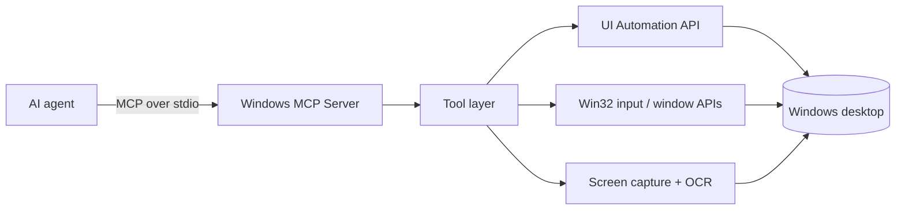

# Architecture

Windows MCP Server is a local [.NET 10](https://dotnet.microsoft.com/) MCP server
that exposes Windows desktop automation to AI agents. Its design follows one core
idea: **let Windows describe the UI semantically, and keep the tools thin.**

## Semantic first, fallback when needed

The server uses the **Windows UI Automation API (UIA)** as the primary
interaction method — the same accessibility API screen readers use. This gives
agents a semantic view of applications: elements are found by name, control type
and automation ID rather than by parsing pixels.

Screenshot + mouse + keyboard remain available as a **fallback** for games,
canvas/OpenGL surfaces and other custom-drawn UIs that expose no accessibility
tree.

## Layers

- **Tool layer** — 10 focused tools (`ui_find`, `ui_click`, `ui_type`,
  `ui_read`, `file_save`, `window_management`, `screenshot_control`,
  `mouse_control`, `keyboard_control`, `app`). Following the project's
  "augmentation, not duplication" principle, tools are thin actuators: they
  expose Windows capabilities without embedding complex logic.
- **Automation** — wraps UIA element discovery, matching and actions.
- **Input** — keyboard and mouse simulation via the standard `SendInput` API,
  with configurable timing.
- **Window** — find, activate, move, resize and wait-for window operations.
- **Capture** — screen and element capture, annotated screenshots and OCR.
- **Native** — P/Invoke bindings to the Win32 and UIA surfaces the tools build on.
- **Prompts** — guidance prompts (such as browser automation) surfaced to the client.

## Token optimization

Responses are designed for LLM efficiency: short property names, JPEG
screenshots and automatic scaling. Annotated screenshots return element metadata
with the image omitted by default. In practice this substantially reduces token
usage compared to standard JSON, which keeps automation loops fast and affordable.

## Transport

The server communicates with its client over **stdio** using the
[Model Context Protocol](https://modelcontextprotocol.io/) via the official
.NET SDK. It is launched by the client (VS Code extension, plugin or a standalone
MCP config entry) and runs as a local process — see [Installation](installation.md).

## LLM-tested quality

Because tool descriptions that read clearly to humans can still confuse a model,
every tool is validated with a **real AI model** (GPT-5.5 via GitHub Copilot) using
[pytest-skill-engineering](https://github.com/sbroenne/pytest-skill-engineering): 130+ automated tests
run through a dedicated manual workflow. They never run as part of PR, CI, or release
workflows. When the AI misuses a tool, the fix is to the tool — not the test prompt.
See [Contributing](contributing.md) for how the test suites are run.
